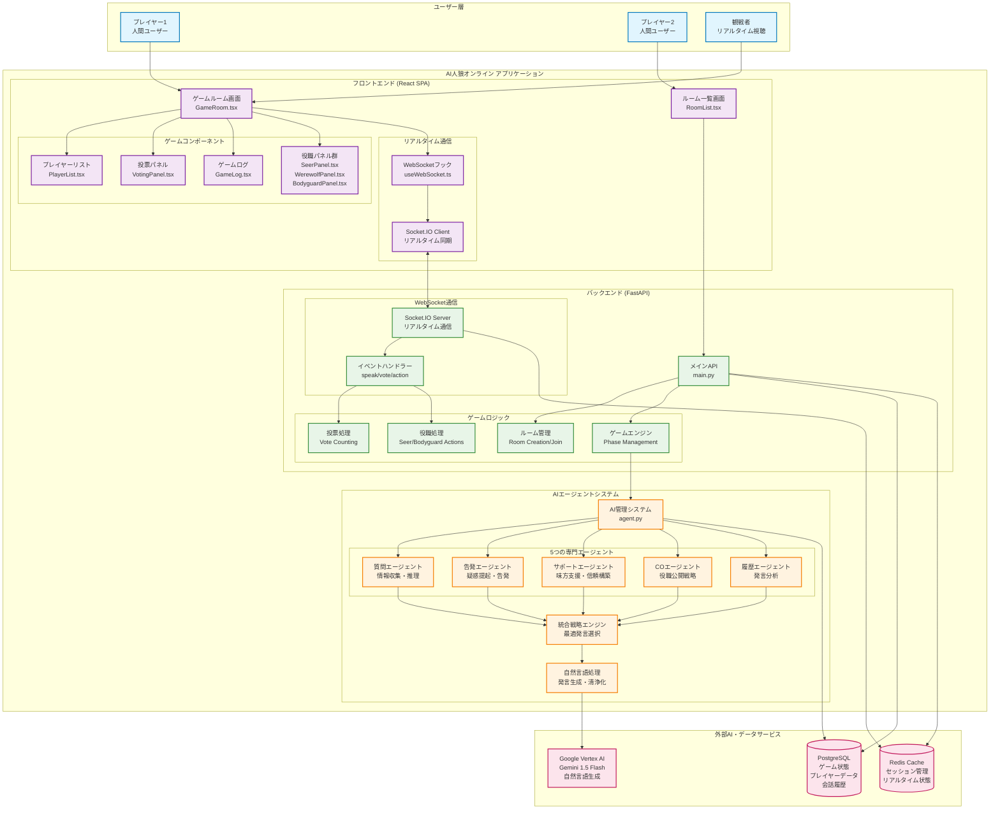
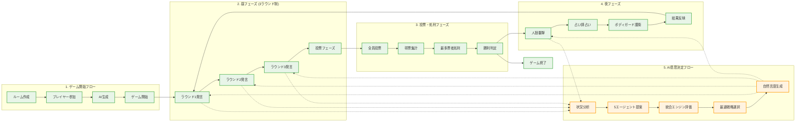
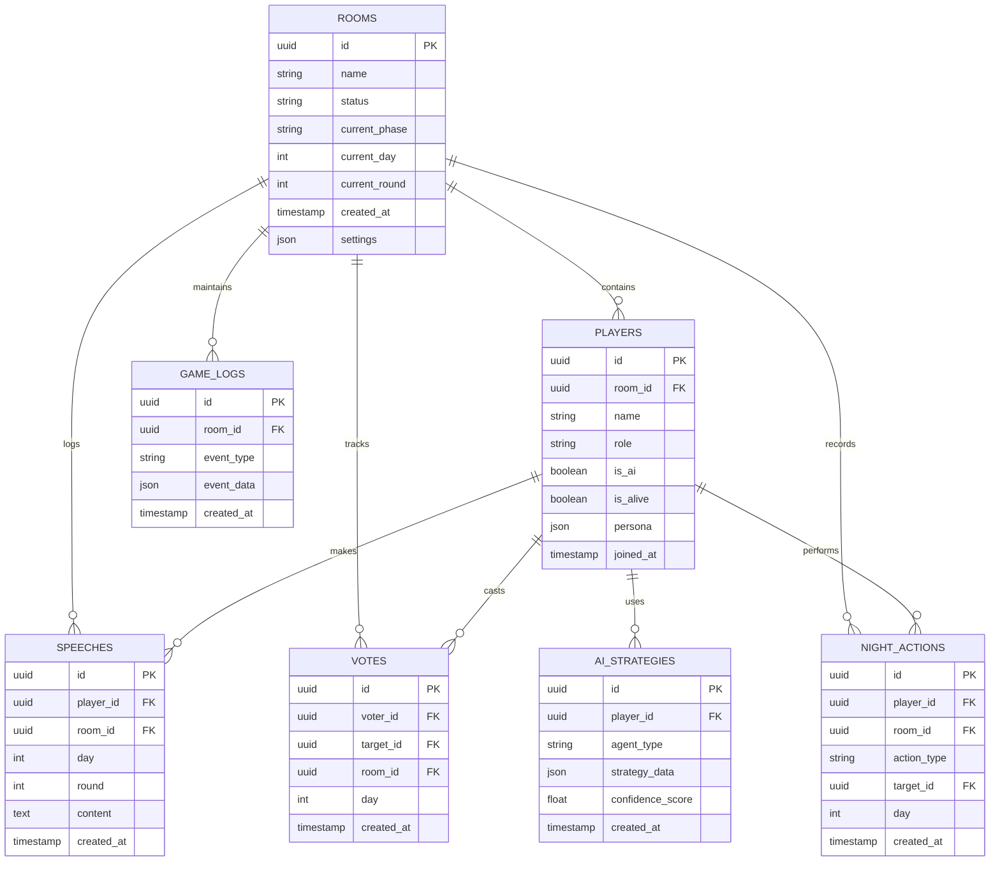
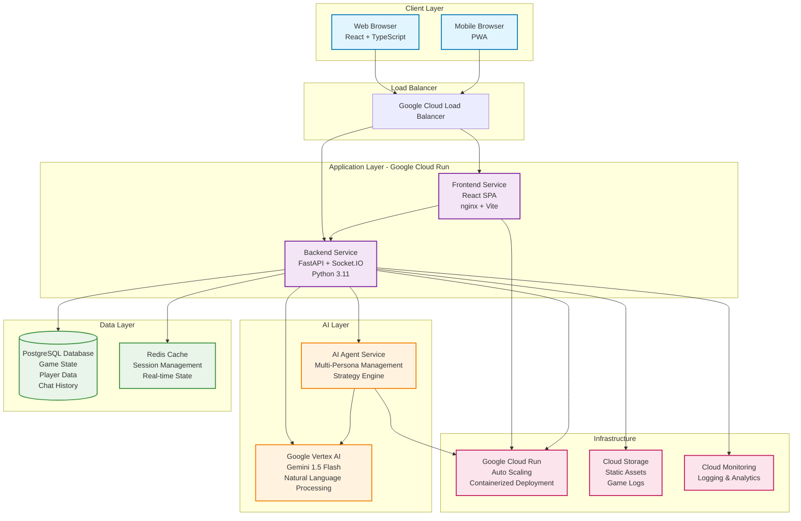
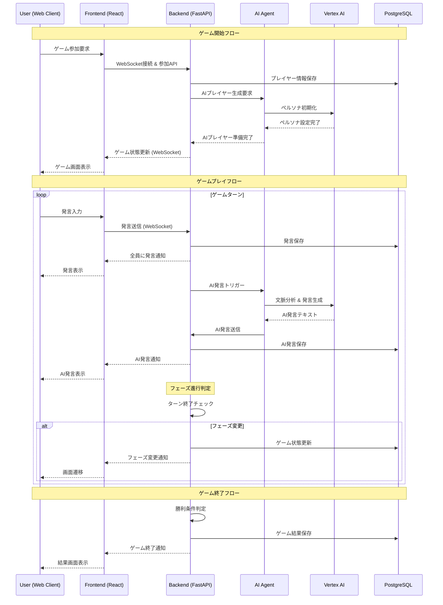
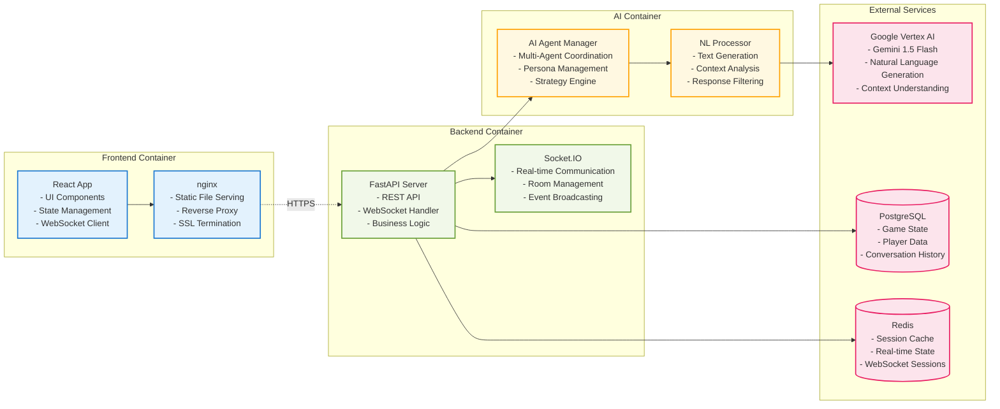
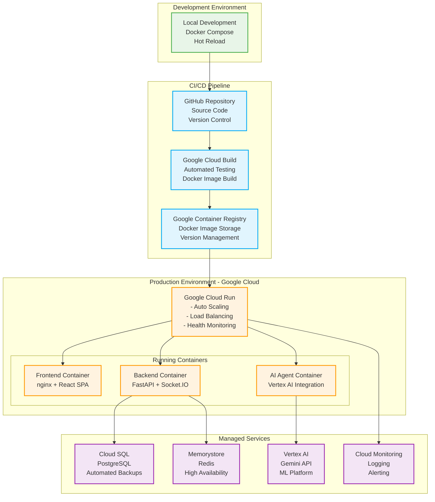
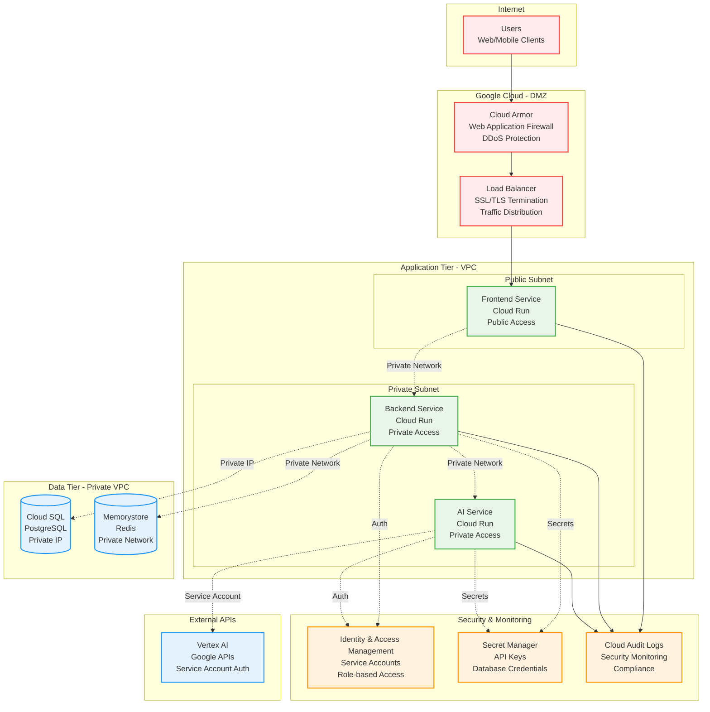

# AI人狼オンライン - システムアーキテクチャ図

## アプリケーション構成図

## ゲームフロー構成図

## データモデル構成図

## 全体システム構成図

## データフロー図

## マイクロサービス構成詳細

## デプロイメント構成図

## セキュリティ・ネットワーク構成

このシステムアーキテクチャは、スケーラビリティ、セキュリティ、パフォーマンスを考慮したクラウドネイティブ設計となっています。Google Cloud Platformの各種マネージドサービスを活用し、高可用性と自動スケーリングを実現しています。